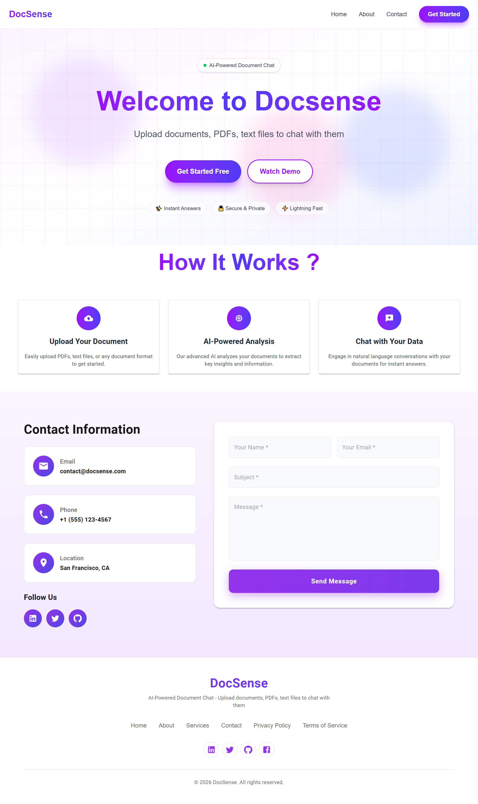
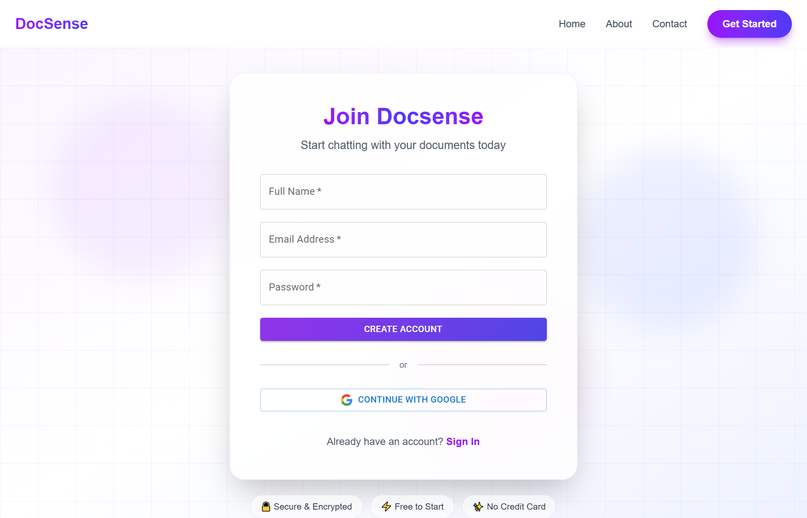
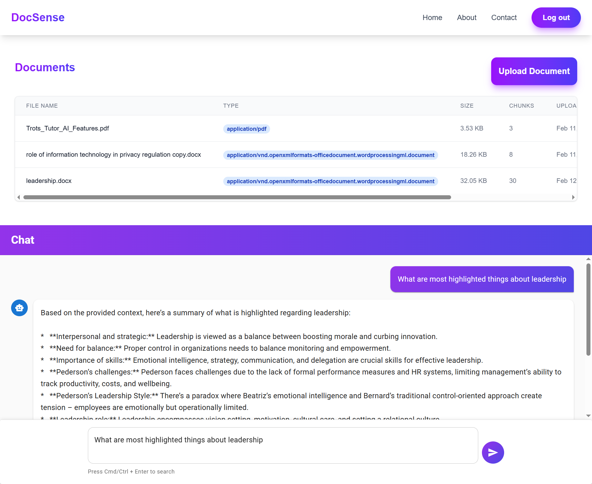

# 🧠 DocSense – AI-Powered Document Chat (RAG)

DocSense is an AI-powered document assistant that allows users to upload documents and chat with them using **Retrieval-Augmented Generation (RAG)**.

Instead of generating generic AI responses, DocSense retrieves relevant document chunks using vector embeddings and produces context-aware answers grounded in the uploaded content.

---

## 🚀 Features

- 📄 Document upload & processing  
- ✂️ Intelligent text chunking  
- 🧠 Embedding generation  
- 📦 Vector storage using Supabase  
- 🔍 Semantic similarity search  
- 💬 Conversational chat interface  
- 🦙 Local LLM inference using Ollama  
- 🔐 Secure authentication system  
- 🎨 Modern UI with Tailwind CSS & Material UI  

---

## 🏗️ Tech Stack

### Frontend
- Next.js (App Router)
- TypeScript
- Tailwind CSS
- Material UI

### Backend / AI Layer
- LangChain (RAG pipeline)
- Ollama (Local LLM execution)

### Database & Authentication
- Supabase (Vector embeddings storage)
- Supabase Authentication

---

## 🧠 How It Works (RAG Architecture)

1. User uploads a document  
2. The document is split into smaller chunks  
3. Embeddings are generated for each chunk  
4. Embeddings are stored in Supabase  
5. When a user asks a question:
   - Relevant chunks are retrieved via semantic search  
   - Retrieved context is sent to the LLM (Ollama)  
   - The AI generates a grounded response  

This ensures answers are based strictly on the uploaded document.

---

## ⚙️ Getting Started

### 1️⃣ Clone the Repository

```bash
git clone https://github.com/Mamoor-s3ltan/DocSense.git
cd DocSense
```
### 2️⃣ Install Dependencies
```bash
npm install
```
### 3️⃣ Setup Environment Variables
```bash
NEXT_PUBLIC_SUPABASE_URL=your_supabase_url
NEXT_PUBLIC_SUPABASE_ANON_KEY=your_supabase_key
```
### 4️⃣ Run Ollama Locally
```bash
ollama run qwen2:7b
```
### 5️⃣ Start Development Server
```bash
npm run dev
```
## 🎯 Project Goals
- Build a full-stack AI SaaS application
- Implement a production-style RAG architecture
- Work with vector databases and semantic search
- Run LLMs locally for privacy and performance
- Combine modern UI with AI engineering

---

## 📸 Screenshots

### 🏠 Home Page


---

### Signup Page


### 💬 Chat Interface


---


